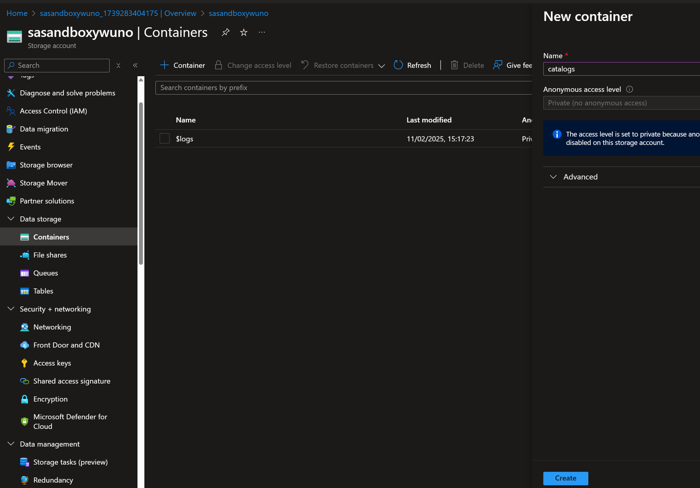

# Azure AI Search

## Create an Azure AI Search resource

1. In a web browser, open the Azure portal at https://portal.azure.com and sign in using your Azure credentials.

2. On the home page, select "+ Create a resource" and search for `Azure AI Search`. Then create a new Azure AI Search resource with the following settings:

* Subscription: Select your Azure subscription
* Resource group: create a resource group with name `rg-ai-search-<your name>-uno`
* Service name: Enter a unique service name e.g. `svc-ai-search-<your name>-uno`
* Location: East US 2
* Pricing Tier: Free
* Review + Create
* Create

|Resource| Type|
|:---|:---|
|svc-ai-search-yw-uno|Search service|

## Create a Storage Account
We created the `rg-ai-search-<your name>-uno` resource group previously.

1. On the home page, select "+ Create a resource" and search for `Storage accounts`.

2. Create a Storage accounts with the following settings:
* Resource group `rg-ai-search-<your name>-uno`
* Name: `sasandbox<your name>uno`
* Region: East US 2
* Performance: Standard
* Redundancy: LRS

3. Review + Create

4. Create

|Resource| Type|
|:---|:---|
|sasandboxywuno|Microsoft.Storage/storageAccounts|

5. Open your storage account, go to `Data storage` page
* click on Containers tab
* click on "+ Container"
* give the name "Catalogs"
* click on "Create"



* Click on the `Catalogs` Container created
* Upload `*.pdf` files to the storage account


## can not access the promptflow

1. AI hub
Settings -> Properties -> Storage account access -> identity-based -> save

2. Disable shared key on storage account
storage account for AI Hub
* Settings - Configuration -> Allow storage account key access (disabled)
* IAM -> Add role assignment
* Choose the roles: 
-> Storage Blob Data Contributor
-> Storage File Data Privileged Contributor
to your current user.

Now you shall have access to the promptflow.

Assign user with
Storage Blob Data Contributor and Storage File Data Privileged Contributor roles

```
Important: When using identity-based authentication, "Storage Blob Data Contributor" and "Storage File Privileged Contributor" roles must be granted to individual users that need access on the storage account
```

Reason: The Storage access key has been disabled on the Storage account.
if your company has a policy to disable it, you will need to find another way.

Refer to this page for information on how to change the access to using Entra ID:

https://learn.microsoft.com/en-gb/azure/ai-studio/how-to/disable-local-auth?tabs=portal#update-an-existing-hub


* https://learn.microsoft.com/en-us/answers/questions/2114208/authentication-failed-when-creating-prompt-flow

## Reference
* Deploy enterpise webapp: https://learn.microsoft.com/en-us/azure/ai-studio/tutorials/deploy-chat-web-app
* Azure AI Search with Azure AI Foundry https://microsoftlearning.github.io/mslearn-ai-studio/Instructions/04-Use-own-data.html

## Issue
* Please verify that Microsoft.web provider is registered for the selected subscription.

