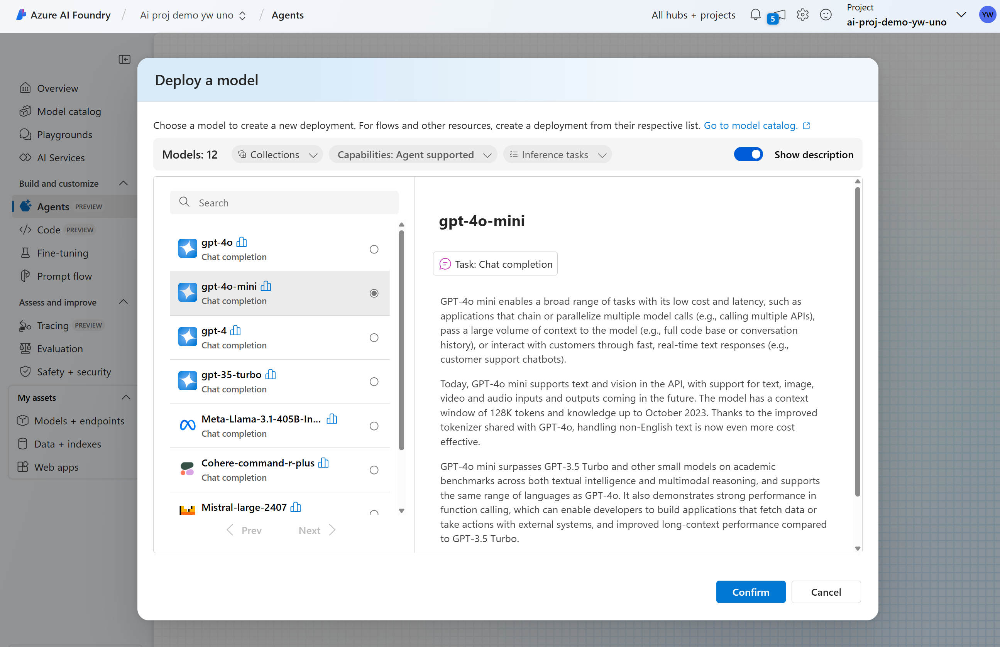
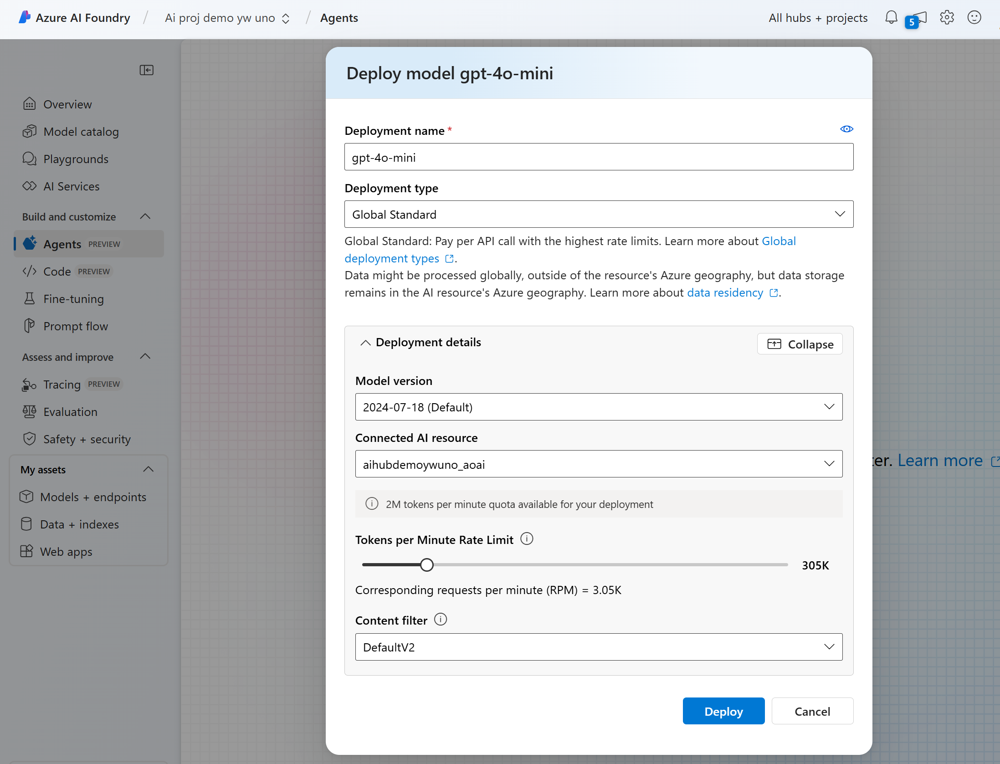
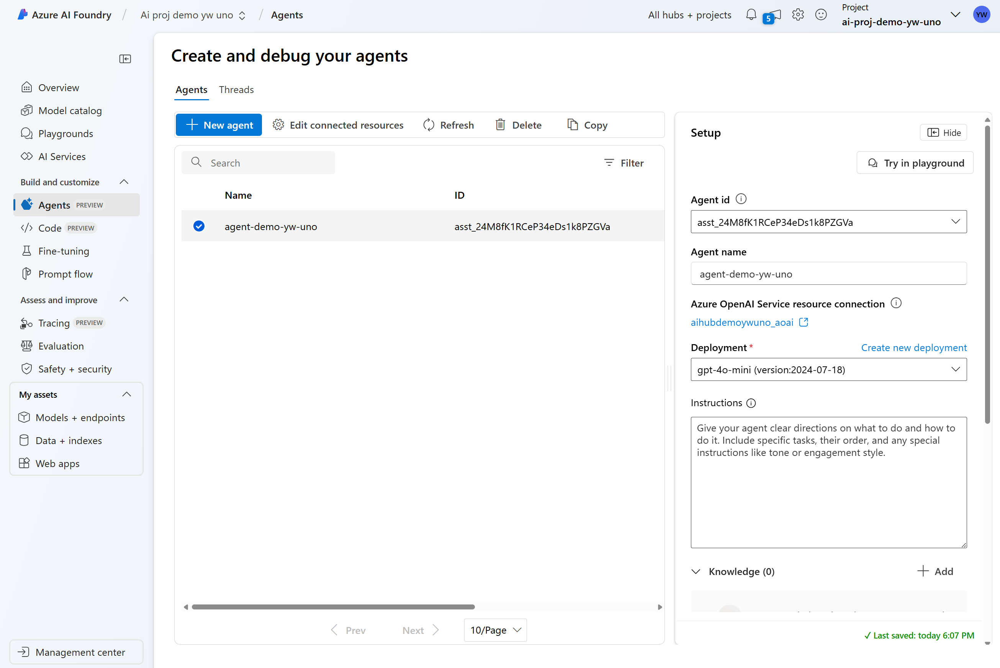
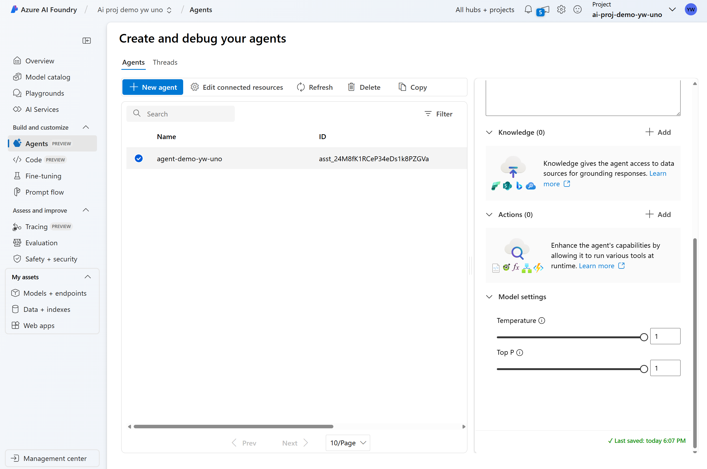

# Agent in Azure AI Foundry

## What is an AI Agent?

Within Azure AI Foundry, an AI Agent acts as a "smart" microservice that can be used to answer questions (RAG), perform actions, or completely automate workflows. It achieves this by combining the power of generative AI models with tools that allow it to access and interact with real-world data sources
[[AI Agent Definition]](https://learn.microsoft.com/en-us/azure/ai-services/agents/overview#what-is-an-ai-agent).


## Deploy Agent models

From your Azure AI Foundry Project:
1. Goto "Agent" tab and choose "gpt-4o-mini" model to deploy
    * Confirm
    

Note:
```
The agent model can execute function calling feature, only limited model has the capacity to use this feature.
```

2. Customize the TPM rate limit to be `> 300K`


3. Deploy

## Create single Agent

From your Azure AI Foundry Project:
1. Goto "Agent" tab
 * In "Setup" panel, change the agent name `agent-demo-<yourname>-uno`
 

2. In "Setup" panel, schroll down to:
    * Add knowledge
    * Actions



## References
* GPT-4o-mini has tool calling feature https://techcommunity.microsoft.com/blog/azure-ai-services-blog/openai%E2%80%99s-gpt-4o-mini-now-available-in-api-with-vision-and-fine-tuning-text-capab/4200640

* Agent playground in Azure AI Foundry: https://learn.microsoft.com/en-us/azure/ai-services/agents/quickstart?pivots=ai-foundry#use-the-agent-playground


