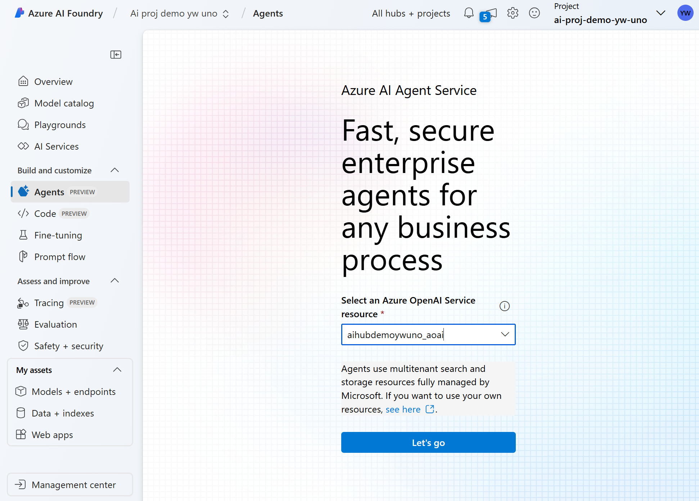
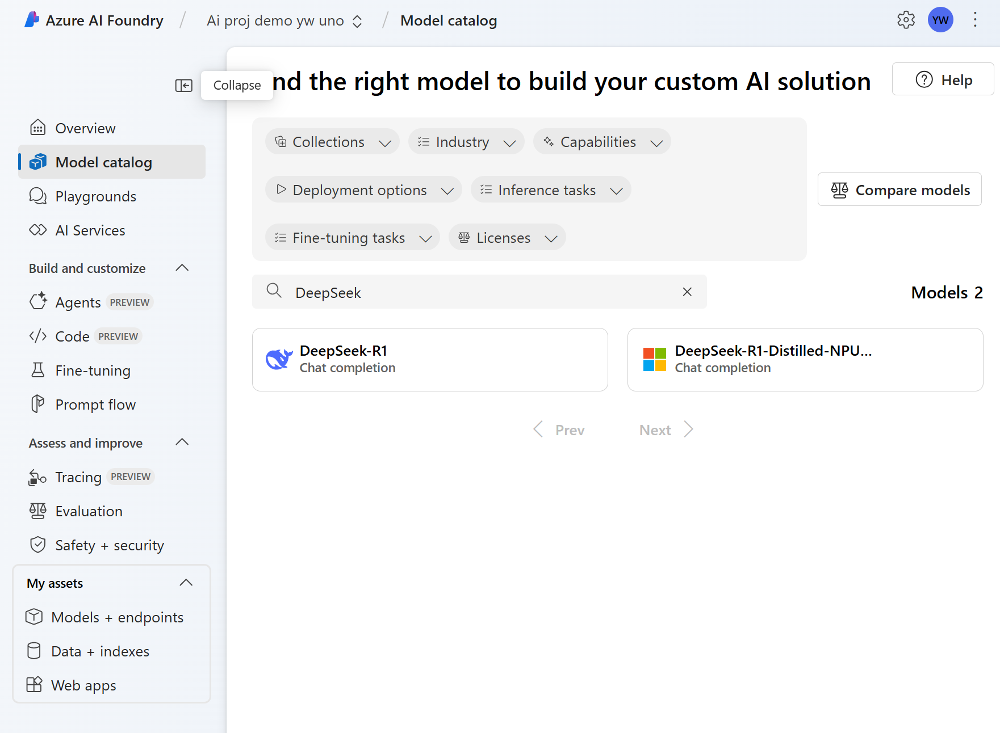
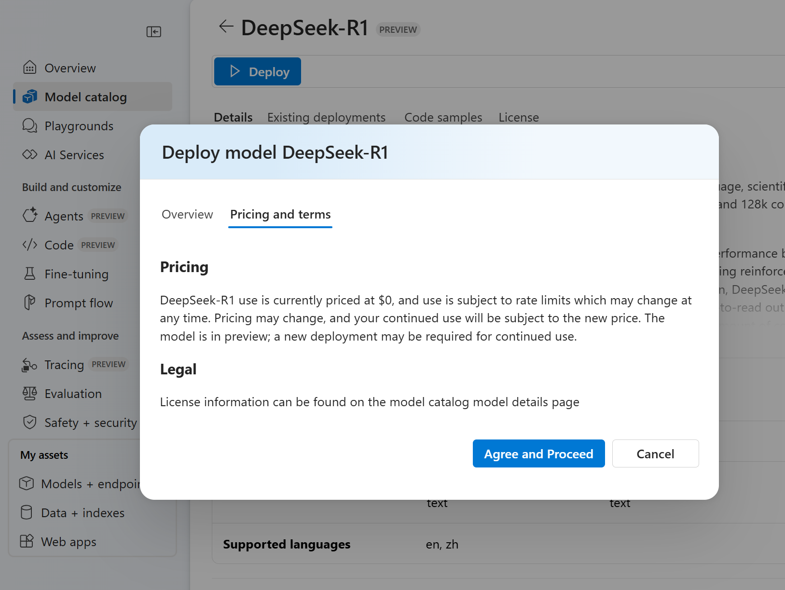
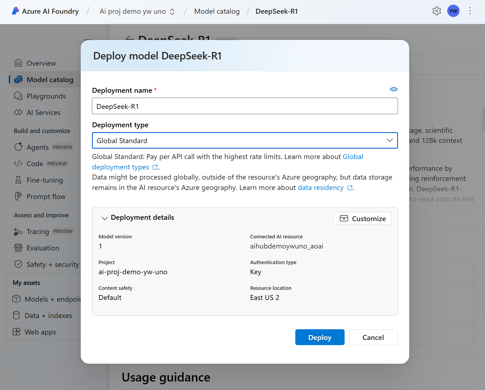
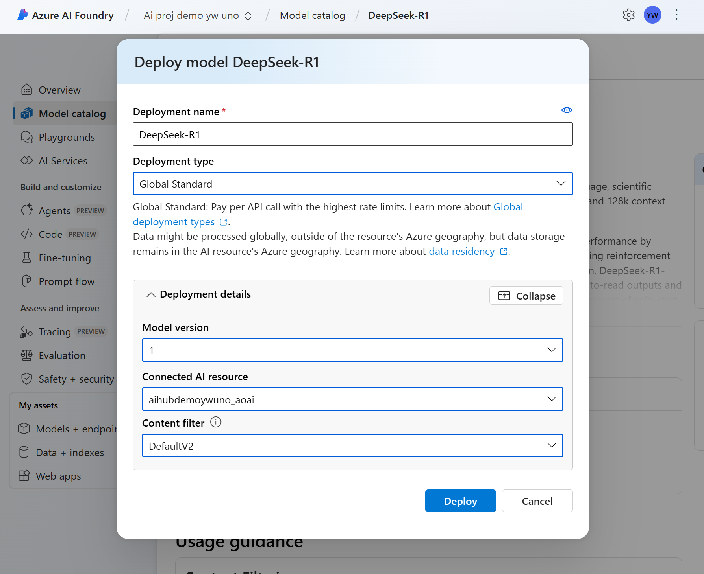
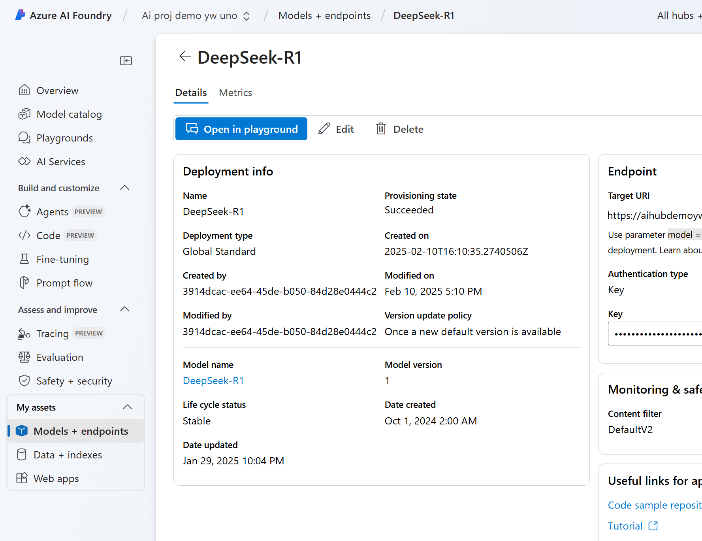
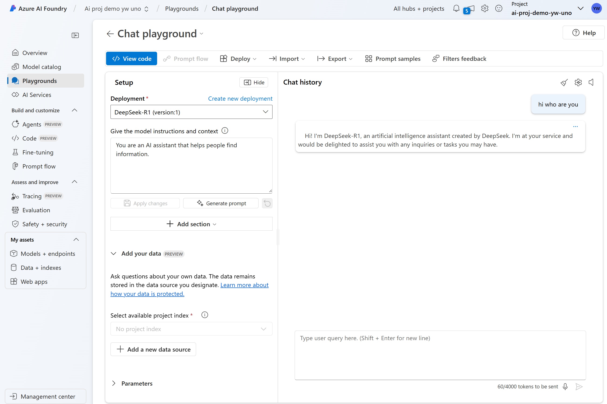

# Get started with Azure AI Foundry

@author: Yingding Wang\
@date: 10.02.2025\
@revision: 1

## Quickstart guide

In your Azure subscription:
1. Create an Azure AI Foundry hub
2. Create an Agent project

### Start AI Foundry from Azure Portal UI

Prerequisites
* An Azure subscription
* Your Azure Portal User have "Azure AI Developer" assigned

#### 1 Create a resource groups
* resource groups in the Azure portal search
* create
* "rg-ai-sandbox-<yourname>-uno"
* Region: East US
* Review + Create
* Create

#### 2 Create a AI Hub in Azure AI Foundry
Hub: Grouping container for projects. Provides security, connectivity, and compute management.

To create a Hub in Azure AI Foundry, follow these steps:

1. Go to Azure AI Foundry

2. Select + "Create v" -> Hub.

3. select resource group `rg-ai-sandbox-<yourname>-uno`

4. select Create new hub, 
    * Resource group: `rg-ai-sandbox-<yourname>-uno`
    * region: East US 2
    * Name: `ai-hub-demo-<yourname>-uno`
    * Connect AI Service -> Create new -> `aihubdemo<yourname>uno` -> save
    * next storage
    * storage -> Create new -> `aihubdemo<yourname>uno` -> LRS -> save
    * key valut -> Create new -> `aihubdemo<yourname>uno`
    -> review + create

**The following Azure resource will be created**:
|Resource | Type |
|:---| :---|
|ai-hub-demo-yingding-uno|Microsoft.MachineLearningServices/workspaces|
|aihubdemoywuno|Microsoft.CognitiveServices/accounts|
|aihubdemoywuno|Key vault|
|aihubdemoywuno|Storage account|

#### 3 Create a AI Project in Azure AI Foundry
Project: Collaborate, organize, and track work to build AI apps.

To create a Project in Azure AI Foundry, follow these steps:

1. Go to Azure AI Foundry

2. Select + "Create v" -> Project.

3. select resource group `rg-ai-sandbox-<yourname>-uno`, Enter a name for the project `ai-proj-demo-<yourname>-uno` 

4. select hub: `ai-hub-demo-<yourname>-uno`

5. review + create

**The following Azure resource will be created**:
|Resource | Type |
|:---| :---|
|ai-proj-demo-yw-uno|Microsoft.MachineLearningServices/workspaces|

#### 4 Go to the Azure AI Foundry Project
* In Azure portal, goto the Azure AI Foundry Project `ai-proj-demo-<yourname>-uno`  
* Overview
* Launch Studio

1. From your project overview, select Agents, located under Build and customize.

2. Select your Azure OpenAI service resource `aihubdemo<yourname>uno_aoai` -> click on `Let'S go`

3. Select a model deployment for the Agent to use.

4. Goto model catalog, search "DeepSeek"

5. Click on "DeepSeek R1"
    * Deploy
    * Agree and Procceed
  

    * Customize 
    

    * Content filter: DefaultV2
    
    * Deploy

6. Play with "Deep Seek R1" via Playground

    * Models + endpints
    * DeepSeek R1
    * Open in playground
    
   
    * chat with DeepSeek R1 
    * Type in the query "hi, who are you?"
    
   

## Reference

* AI Foundry Agents Overview: https://learn.microsoft.com/en-us/azure/ai-services/agents/overview
* AI Foundry Quickstart with AI Foundry from Azure Portal UI https://learn.microsoft.com/en-us/azure/ai-services/agents/quickstart?pivots=ai-foundry
*RBAC role for Azure AI Foundry portal https://learn.microsoft.com/en-us/azure/ai-studio/concepts/rbac-ai-studio

## Blogs
* DeepSeek R1 available on Azure AI Foundry and Github https://techcommunity.microsoft.com/discussions/marketplace-forum/deepseek-r1---now-available-on-azure-ai-foundry-and-github/4372176

