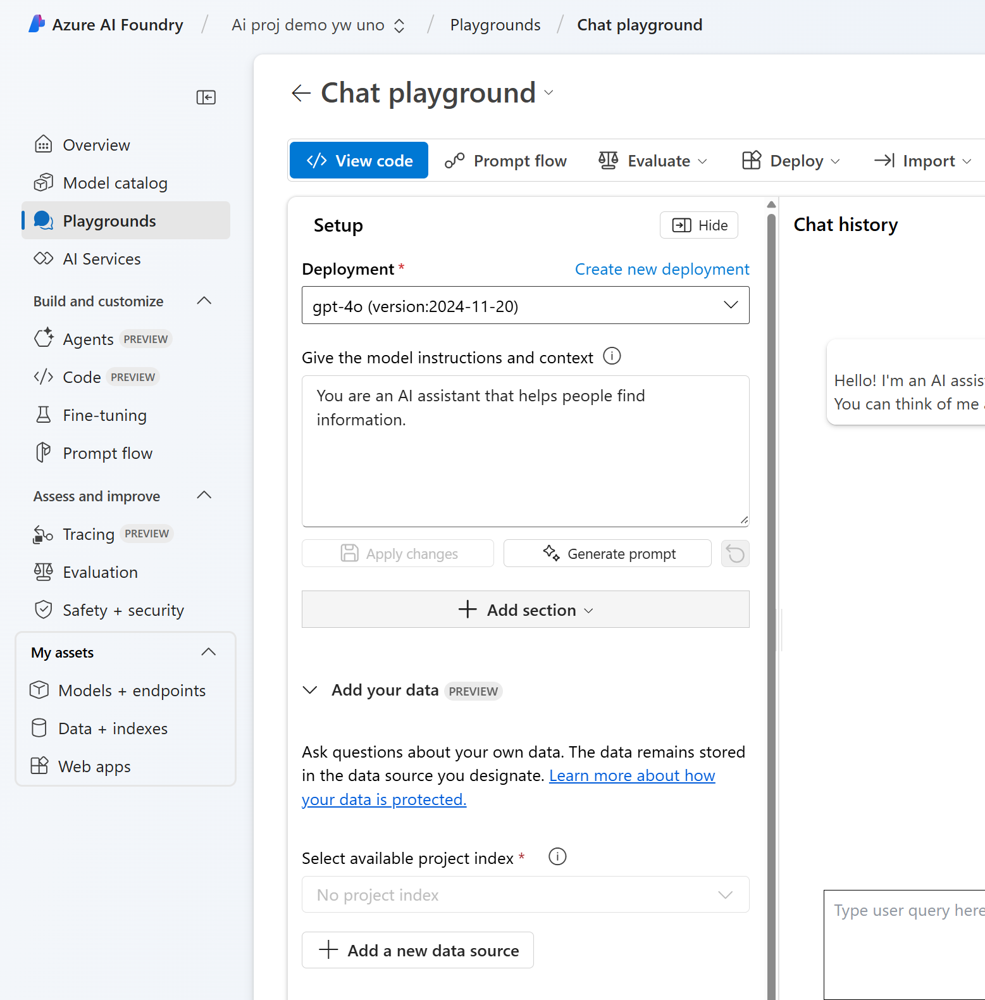

# Deploy models in Azure AI Foundry

## Deploy "text-embedding-ada-002" for AI Search

1. Login to the Azure AI Foundry portal https://ai.azure.com

2. In your project, in the navigation pane on the left, under `My assets`, select the `Models + endpoints` page.

3. Create a new deployment of the `text-embedding-ada-002` model with the following settings by selecting Customize in the `Deploy model` dropdown `Deploy base model` wizard:

* Deployment name: `text-embedding-ada-002`
* Deployment type: Standard
* Customize
    * Model version: Select the default version
    * Connected AI resource: Select the resource created previously `aihubdemo<yourname>uno_aoai`
    * Tokens per Minute Rate Limit (thousands): 40K
    * Content filter: DefaultV2
    * Enable dynamic quota: Disabled
* Deploy

## Deploy "gpt-4o" for AI Search

1. In your project, in the navigation pane on the left, under `My assets`, select the `Models + endpoints` page.

3. Create a new deployment of the `gpt-4o` model with the following settings by selecting Customize in the `Deploy model` dropdown `Deploy base model` wizard:

* Deployment name: `gpt-4o`
* Deployment type: Standard
* Customize
    * Model version: Select the default version
    * Connected AI resource: Select the resource created previously `aihubdemo<yourname>uno_aoai`
    * Tokens per Minute Rate Limit (thousands): 40K
    * Content filter: DefaultV2
* Deploy

## Add data connections to AI project

1. In your project, in the navigation pane on the left, under `My assets`, select the `Data + indexes` page.
* `+ new data`
* In the "add your data" panel, `+ New connect`
    * Service: Azure Blob storage
    * Storage account: `sasandbox<yourname>uno`
    * Blog container: ``Catalogs`
    * Authentication method: `Credential based`
    * Authentication type: Account key
    * Account key: `<copy account key> for the storage account`
    
    * Connection name: `my_catalog_data`
    * Create connection

2. Select `<your pdf file>`, click next

3. Name: `<your data name>`, create

## Add Index to AI project

1. In your project, in the navigation pane on the left, under `My assets`, select the `Data + indexes` page.

* `+ New Index`
    * Data source: Azure Blob Storage
    * Blob store: `my_catalog_data`
    * Choose file to index
    * Next

## Playground with Azure AI Search

1. Open "gpt-4o" in Playground in Azure AI Foundry
   * click on "Open in playground"

2. Click on the "add a new data source"

3. In the "Add your data" plane:
* Data source: Azure Blob Storage
* Blob storage: my_catalog_data
* choose the PDF file in your blob storage
* Click on "Next" 

4. Connect to the existing Azure AI search resource

5. Add connection to `svc-ai-search-<your name>-uno`

6. Select the ai search service `svcaisearch<your name>uno`
    * Next

7. In the Search setting, click on Next
   

8. Create Vector Index

Reference:
* https://microsoftlearning.github.io/mslearn-ai-studio/Instructions/04-Use-own-data.html
