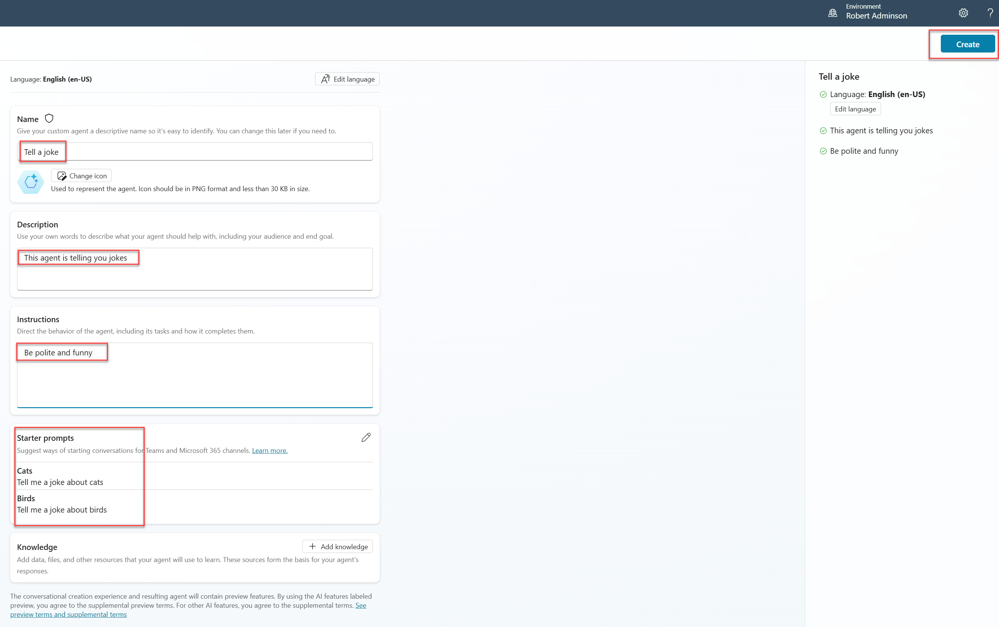
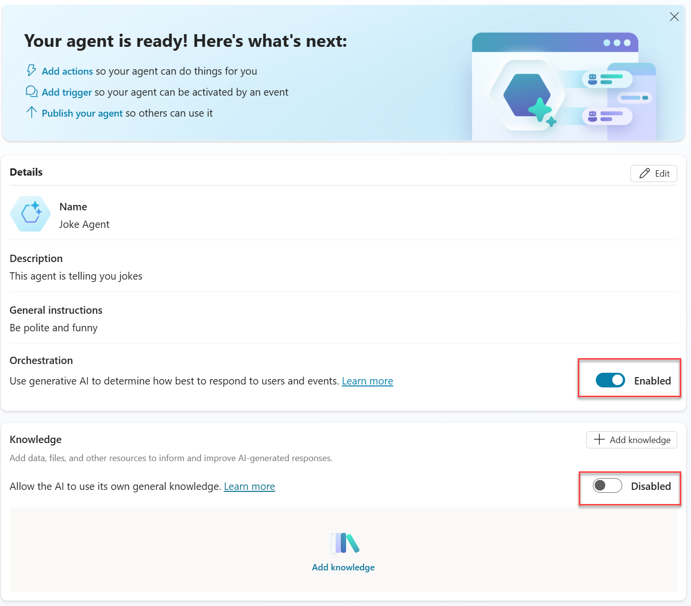
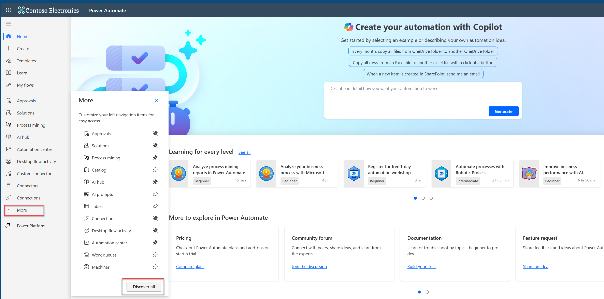
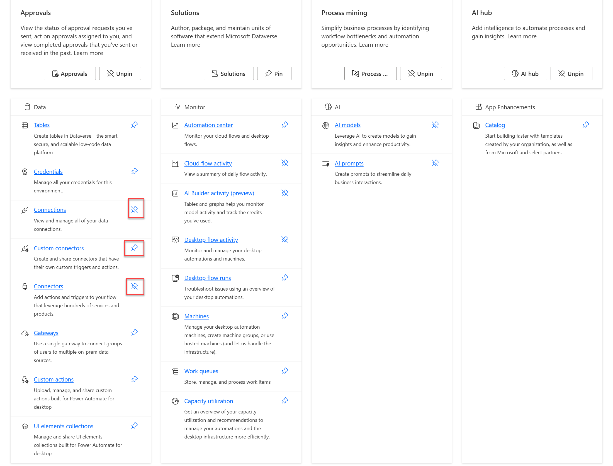
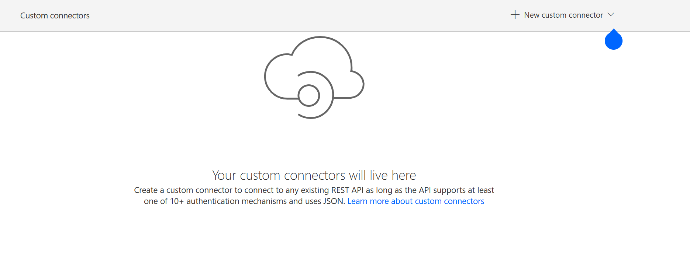
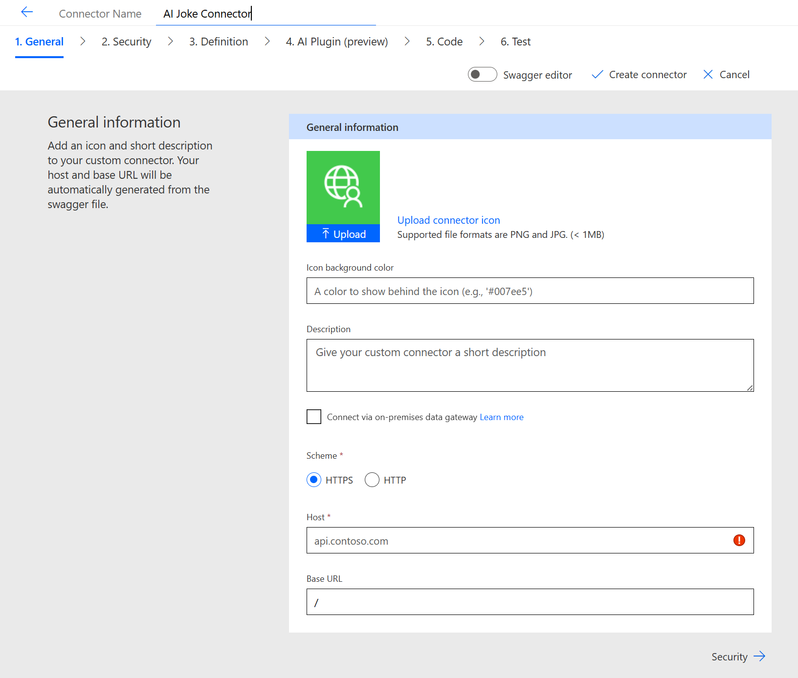
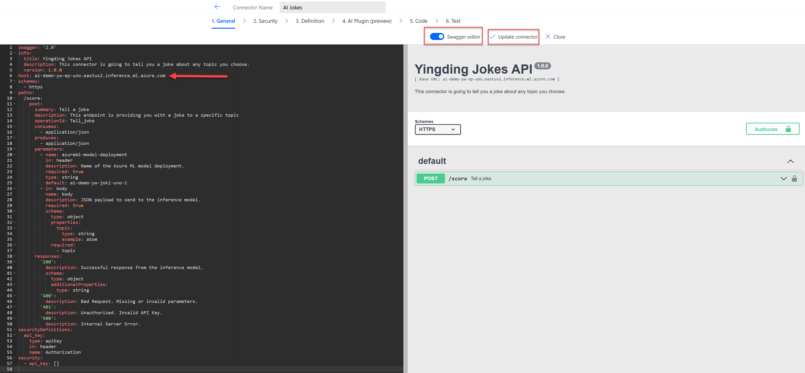

# Copilot Studio

## Create your agent in copilot studio

Call the browser in InPrivate mode and type the [[Copilot Studio]](https://copilotstudio.preview.microsoft.com)
Use the user credentials assigned to you to sign into the demo tenant. Set-Up the MFA if needed.
When you set up the MFA you can create a new user profile in browser so that you can log in again without having to enter the credentials.

In Copilot Studio, you can create a new agent by description. Assure that you have selected your own personal developer environment.

 

 You can continue in the dialogue and enter decriptions or user "Skip to configure" button to use the configureation pane directly.
 Upon finishing, press "Create" to create your agent.
 
 

 

After your agent is created, enable GenAI orchestration and disable the feature "Allow the AI to use its own general knowledge."

## Add an action to your agent

### Create a custom connector 
For your agent to connect to Azure Foundry endpoints, you need to create a custom connector.

Go to [[Power Automate]](https://make.preview.powerautomate.com)
You will have to switch on some menu points on the left side

Choose "Discover all" and turn on the "Connections", "Connectors" and  "Custom Connectors"

Go to the menu point "custom connectors" and create a new one from blank. Enter a name "AI Joke Connector" or whatever you like.

 

After you did this, hit "Create connector"
 

 Switch the button "Swagger editor" on and copy the swagger file into the editor.
 

 Here is the file:
 [swagger template](main/imgs_mcs/custom_connector_swagger_file_1.txt)
 
