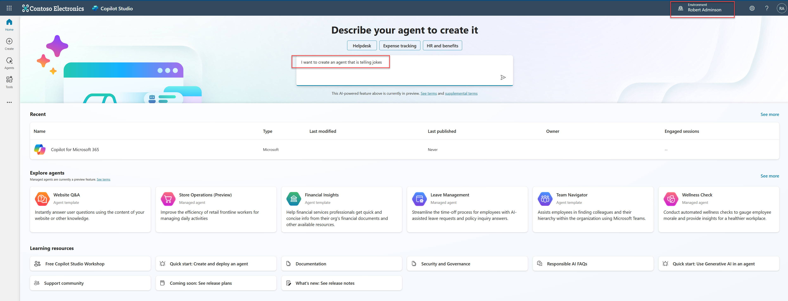

# Copilot Studio

## Create your agent in copilot studio

Call the browser in InPrivate mode and type the [[Copilot Studio]](https://copilotstudio.preview.microsoft.com)
Use the user credentials assigned to you to sign into the demo tenant. Set-Up the MFA if needed.
When you set up the MFA you can create a new user profile in browser so that you can log in again without having to enter the credentials.

In Copilot Studio, you can create a new agent by description. Assure that you have selected your own personal developer environment.
 
