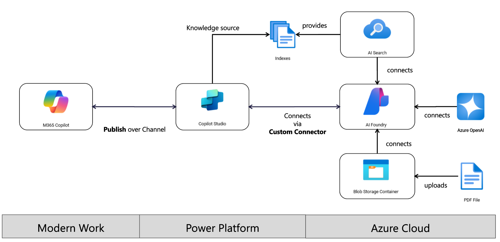

# Agenda 

This is the Agenda of Hackathon "AI Integration Copilot and Azure AI Foundry" on May 2025.

## Table of Content

Overall **Architecture** across **Multiple Disciplines**

## Part 1: Azure AI Foundry
Hackathon content
1. [Deploy Azure AI Foundry resources on Azure Subscription](./docs/01%20GetStarted.md)
2. [Deploy Azure AI Search resources on Azure Subscription](./docs/02%20AISearch.md)
3. [Deploy Models using Azure AI Foundry](./docs/03%20DeployModels.md)
<!--
4. [Deploy single Agent workflow with PromptFlow](./docs/04%20SingleAgentFlow.md)
-->
## Part 2: Microsoft Copilot Studio (MCS)
1. [Copilot Studio Connecting to Azure Foundry](./docs/07%20Copilot%20Studio%20with%20Azure%20Foundry.md)

2. [Copilot Studio Connecting to Azure AI Search](./docs/08%20Copilot%20Studio%20with%20Azure%20AI%20Search.md)

3. [Copilot Studio with Office365 and Azure Foundry](./docs/09%20Copilot%20Studio%20with%20Office365%20and%20Azure%20Foundry.md)

Optional homeworks (WIP)
* Deploy WebApp from Azure AI Foundry
* A preview of Azure AI Foundry Agent Playground

