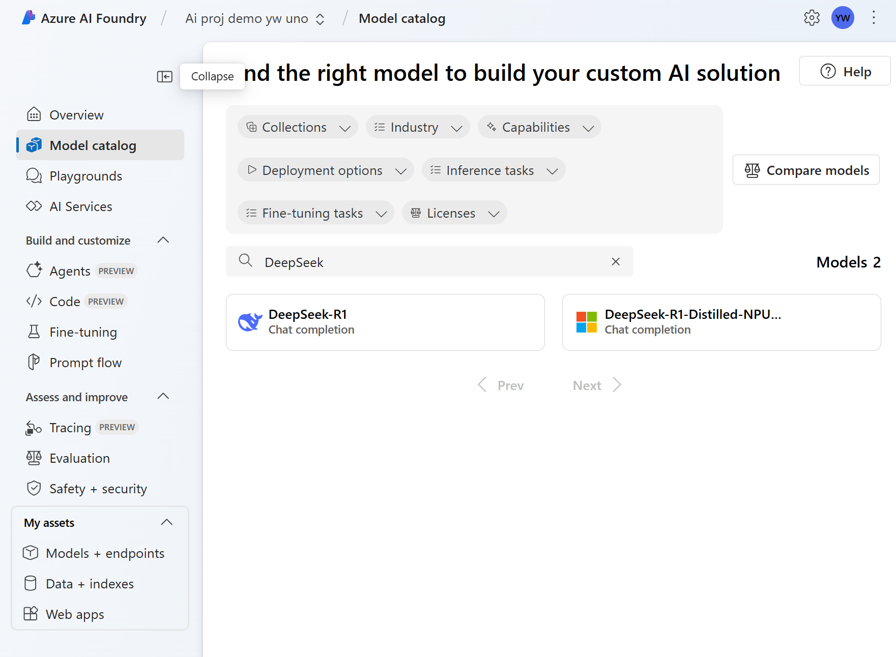
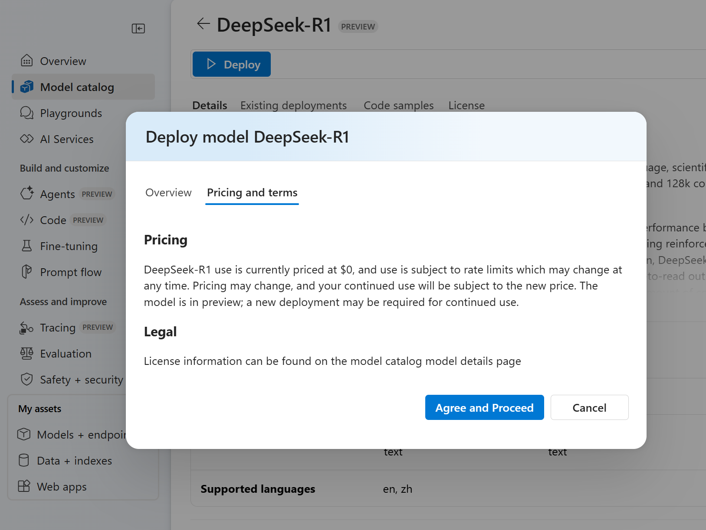
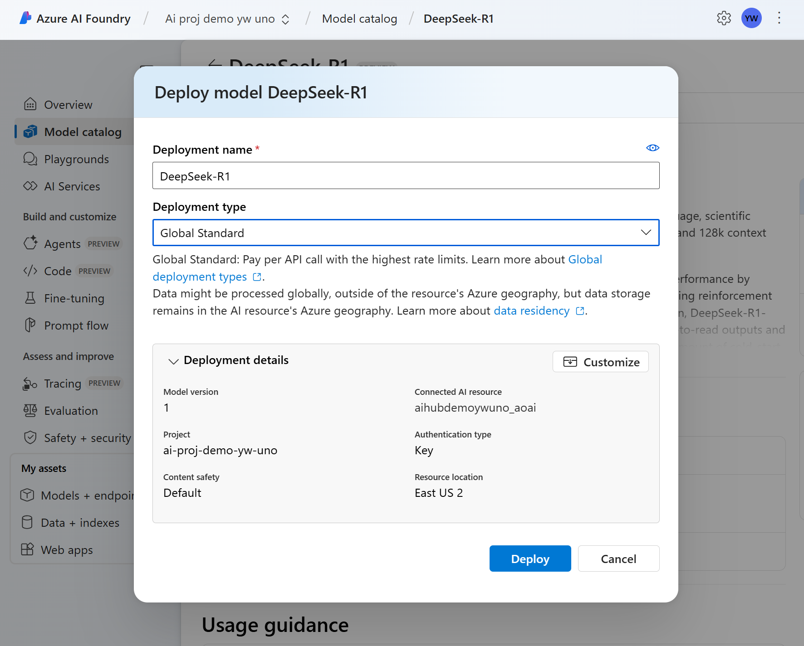
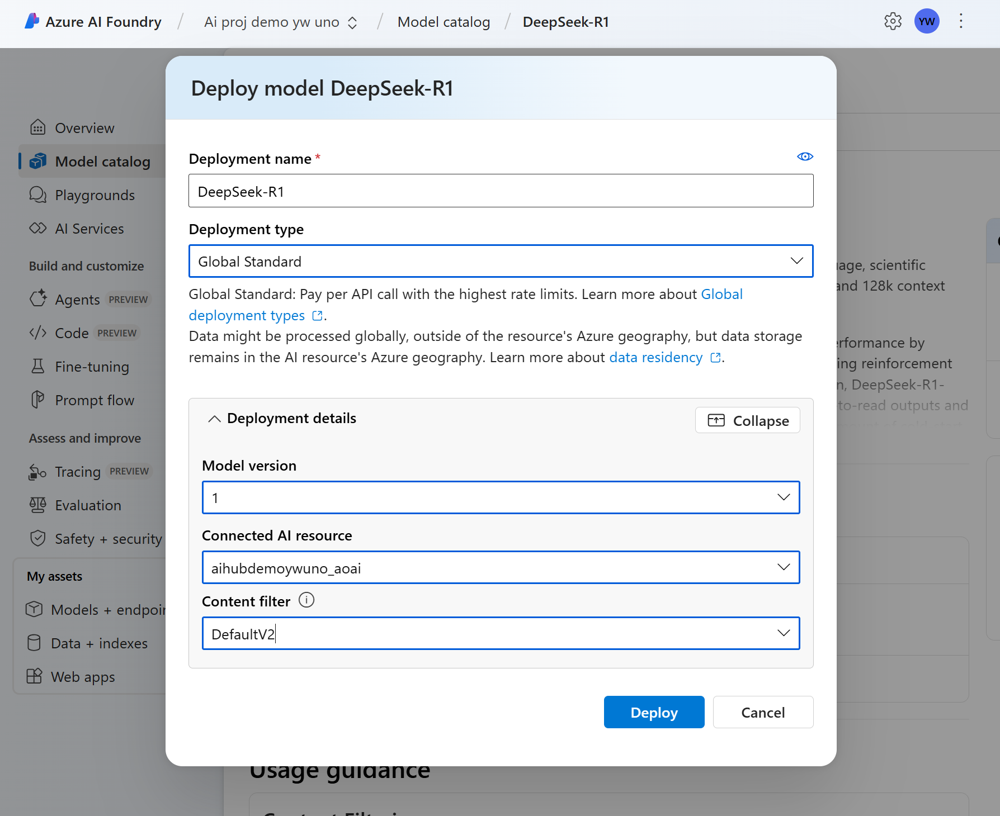
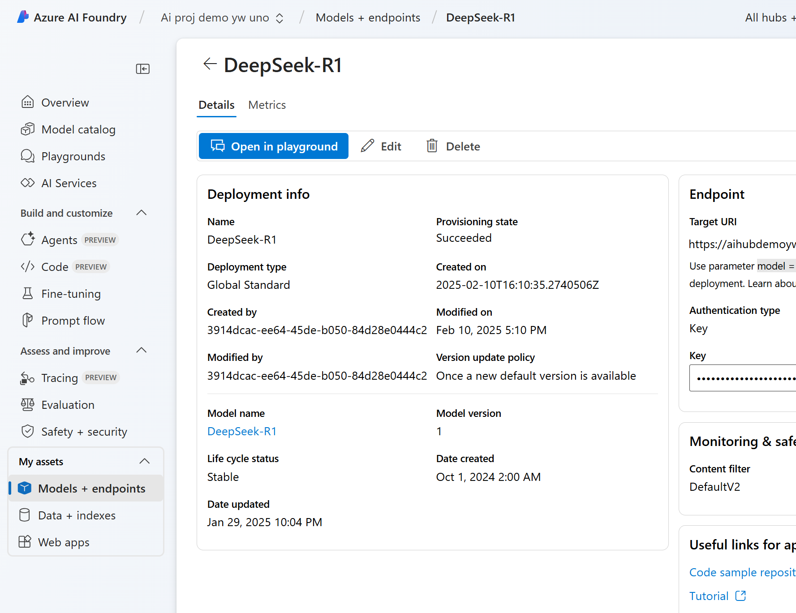
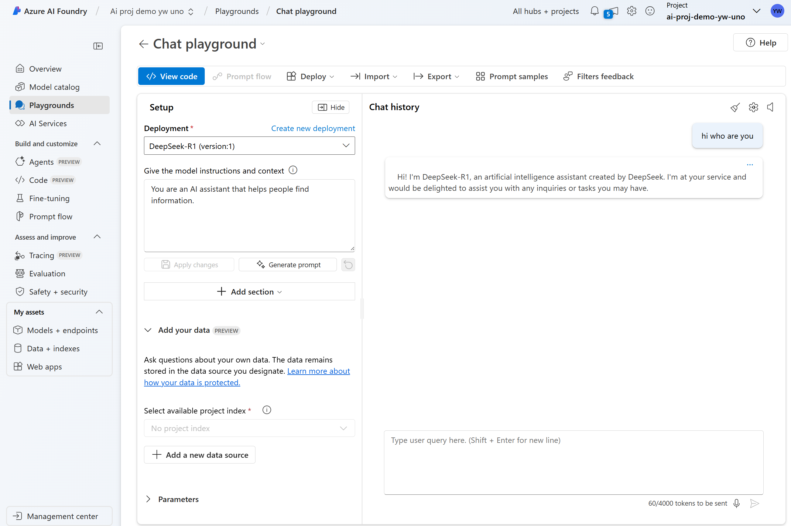

# Get started with Azure AI Foundry

@author: Yingding Wang\
@date: 10.02.2025\
@revision: 1

## Quickstart guide

In your Azure subscription:
1. Create an Azure AI Foundry hub
2. Create an Agent project

### Start AI Foundry from Azure Portal UI

Prerequisites
* An Azure subscription
* Your Azure Portal User have "Azure AI Developer" assigned

#### 0 Login to Azure Portal

In a web browser, open the Azure portal at https://portal.azure.com and sign in using your Azure credentials.

#### 1 Create a resource groups

* Search "resource groups" in the Azure portal top searchbar.
* create
* "rg-ai-sandbox-<yourname>-uno"
* Region: East US 2 / East US
* Review + Create
* Create

#### 2 Create a AI Hub in Azure AI Foundry
Hub: Grouping container for projects. Provides security, connectivity, and compute management.

To create a Hub in Azure AI Foundry, follow these steps:

1. Go to Azure AI Foundry in Azure Portal

2. Select + "Create v" -> Hub.

3. select resource group `rg-ai-sandbox-<yourname>-uno`

4. select Create new hub, 
    * Resource group: `rg-ai-sandbox-<yourname>-uno`
    * region: East US 2
    * Name: `ai-hub-demo-<yourname>-uno`
    * Connect AI Service -> Create new -> `aihubdemo<yourname>uno` -> save
    * next storage
    * storage -> Create new -> `aihubdemo<yourname>uno` -> LRS -> save
    * key valut -> Create new -> `aihubdemo<yourname>uno`
    -> review + create

**The following Azure resource will be created**:
|Resource | Type |
|:---| :---|
|ai-hub-demo-yingding-uno|Microsoft.MachineLearningServices/workspaces|
|aihubdemoywuno|Microsoft.CognitiveServices/accounts|
|aihubdemoywuno|Key vault|
|aihubdemoywuno|Storage account|

#### 3 Create a AI Project in Azure AI Foundry
Project: Collaborate, organize, and track work to build AI apps.

To create a Project in Azure AI Foundry, follow these steps:

1. Go to Azure AI Foundry in Azure Portal

2. Select + "Create v" -> Project.

3. select resource group `rg-ai-sandbox-<yourname>-uno`, Enter a name for the project `ai-proj-demo-<yourname>-uno` 

4. select hub: `ai-hub-demo-<yourname>-uno`

5. review + create

**The following Azure resource will be created**:
|Resource | Type |
|:---| :---|
|ai-proj-demo-yw-uno|Microsoft.MachineLearningServices/workspaces|

#### 4 Go to the Azure AI Foundry Project
* In Azure portal, goto the Azure AI Foundry Project `ai-proj-demo-<yourname>-uno`  
* Overview
* Launch Studio

1. From your project overview, select Agents, located under Build and customize.

2. Select your Azure OpenAI service resource `aihubdemo<yourname>uno_aoai` -> click on `Let'S go`

3. Select a model deployment for the Agent to use.

4. Goto model catalog, search "DeepSeek"

5. Click on "DeepSeek R1"
    * Deploy
    * Agree and Procceed
    

    * Customize 
    

    * Content filter: DefaultV2
    
    * Deploy

6. Play with "Deep Seek R1" via Playground

    * Models + endpints
    * DeepSeek R1
    * Open in playground
    
   
    * chat with DeepSeek R1 
    * Type in the query "hi, who are you?"
    
   

## (Optional) Update identity-based storage account access

Should you encounter the issue that you can not access the storage account for  the Azure AI Foundry Project. Please double check if the `storage account key accesss` of your AI hub storage account (`aihubdemo<your name>uno`) is deactivated by default.

1. double check whether the storage account's key access is deactivated
* Open your AI hub storage account through Azure Portal
* Open `Configuration` tab under `Settings` menu
* double check whether `Allow storage account key access` is disabled.

Should `Allow storage account key access` is disabled for your AI hub storage account  (`aihubdemo<your name>uno`)

2. Set AI hub to use `identity-based` storage account access
* Navigate in Azure portal to the resource AI hub `ai-hub-demo-<yourname>-uno`
* Under `Settings`, choose `Properties` section
* Set `Storage account access` to `identtiy-based`
* save

3. Add **every** of your AI-hub / AI project user with RBAC role to access the default AI-hub storage account
* Open your AI hub storage account (`aihubdemo<your name>uno`) from Azure Portal
* Navigate to `IAM` plane
* click on the menu `Add role assignment` on the top of the `IAM` plane
* Choose and add the roles `Storage Blob Data Contributor` and `Storage File Data Privileged Contributor` to all your AI-hub / AI project user, who shall be able to access the default AI-hub storage

Note:
* AI hub storage access is needed, if your user need to create Promptflow for your AI project inside the Azure AI Foundry.

Reason for this optional setting:
* If the Storage access key has been disabled on the Storage account by your company policy in Azure tenant.

## (Optional) Update Azure AI Service with additional roles
1. Add your AI project user with RBAC role `Cognitive Services User` for `aihubdemo<your name>uno` Azure AI Service to allow project user to access content safety features and try out the testing

Note:
* with error `Your account does not have access to this resource, ...` https://learn.microsoft.com/en-gb/azure/ai-services/content-safety/concepts/response-codes#azure-ai-foundry-error-messages

## Reference

* AI Foundry Agents Overview: https://learn.microsoft.com/en-us/azure/ai-services/agents/overview
* AI Foundry Quickstart with AI Foundry from Azure Portal UI https://learn.microsoft.com/en-us/azure/ai-services/agents/quickstart?pivots=ai-foundry
*RBAC role for Azure AI Foundry portal https://learn.microsoft.com/en-us/azure/ai-studio/concepts/rbac-ai-studio
* Disable local auth for AI hub https://learn.microsoft.com/en-gb/azure/ai-studio/how-to/disable-local-auth?tabs=portal#update-an-existing-hub
* Authentication failed while creating promptflow https://learn.microsoft.com/en-us/answers/questions/2114208/authentication-failed-when-creating-prompt-flow
* Azure AI Content Safety user role https://learn.microsoft.com/en-gb/azure/ai-services/content-safety/concepts/response-codes#azure-ai-foundry-error-messages

## Blogs
* DeepSeek R1 available on Azure AI Foundry and Github https://techcommunity.microsoft.com/discussions/marketplace-forum/deepseek-r1---now-available-on-azure-ai-foundry-and-github/4372176

