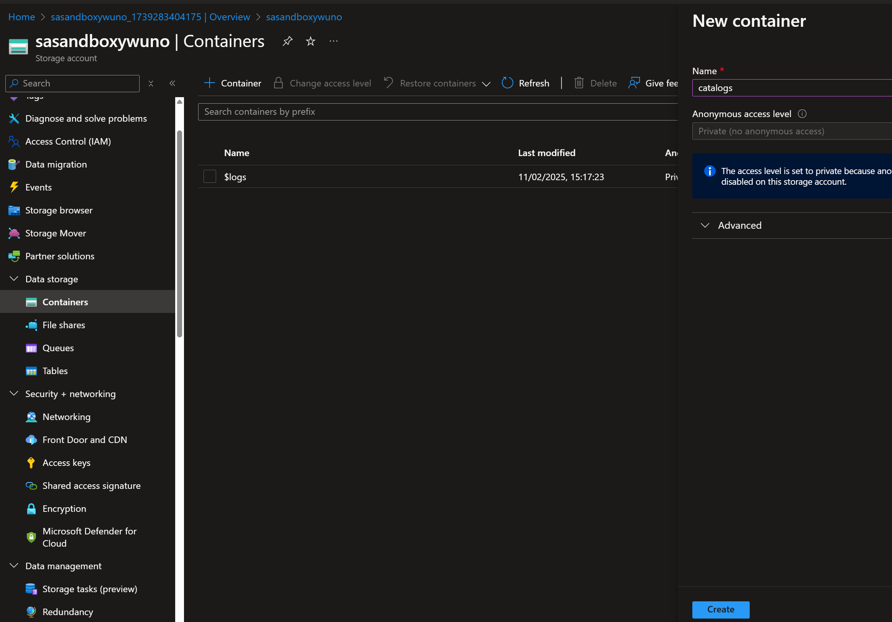

# Azure AI Search

## Create an Azure AI Search resource

1. In a web browser, open the Azure portal at https://portal.azure.com and sign in using your Azure credentials.

2. On the home page, select "+ Create a resource" and search for `Azure AI Search`. Then create a new Azure AI Search resource with the following settings:

* Subscription: Select your Azure subscription
* Resource group: create a resource group with name `rg-ai-search-<your name>-uno`
* Service name: Enter a unique service name e.g. `svc-ai-search-<your name>-uno`
* Location: East US 2
* Pricing Tier: Basic
* Review + Create
* Create

|Resource| Type|
|:---|:---|
|svc-ai-search-yw-uno|Search service|

## Create a Storage Account
We created the `rg-ai-search-<your name>-uno` resource group previously.

1. On the home page, select "+ Create a resource" and search for `Storage accounts`.

2. Create a Storage accounts with the following settings:
* Resource group `rg-ai-search-<your name>-uno`
* Name: `sasandbox<your name>uno`
* Region: East US 2
* Performance: Standard
* Redundancy: LRS

3. Review + Create

4. Create

|Resource| Type|
|:---|:---|
|sasandboxywuno|Microsoft.Storage/storageAccounts|

5. Open your storage account, go to `Data storage` page
* click on Containers tab
* click on "+ Container"
* give the name "Catalogs"
* click on "Create"

* Click on the `Catalogs` Container created
* Upload `*.pdf` files to the storage account
