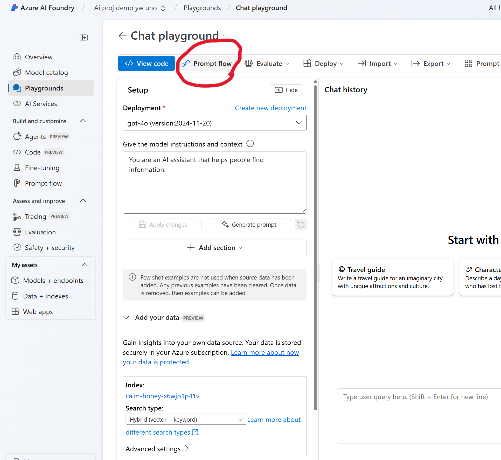
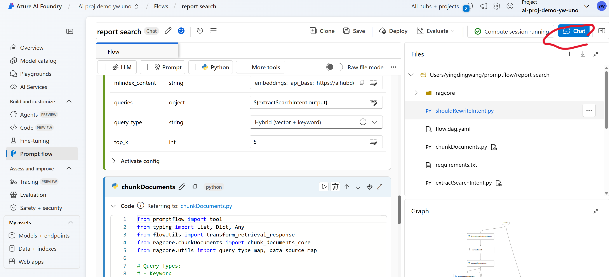
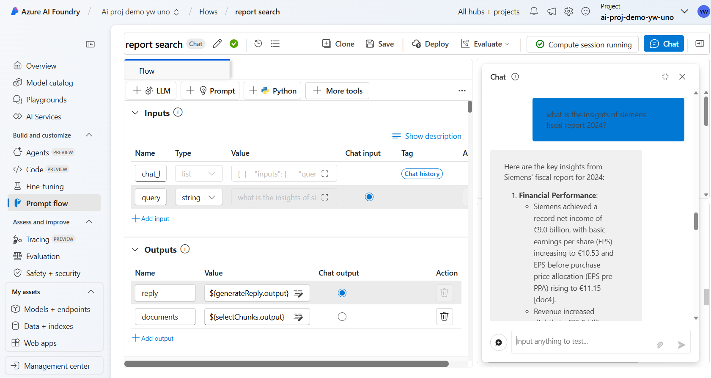
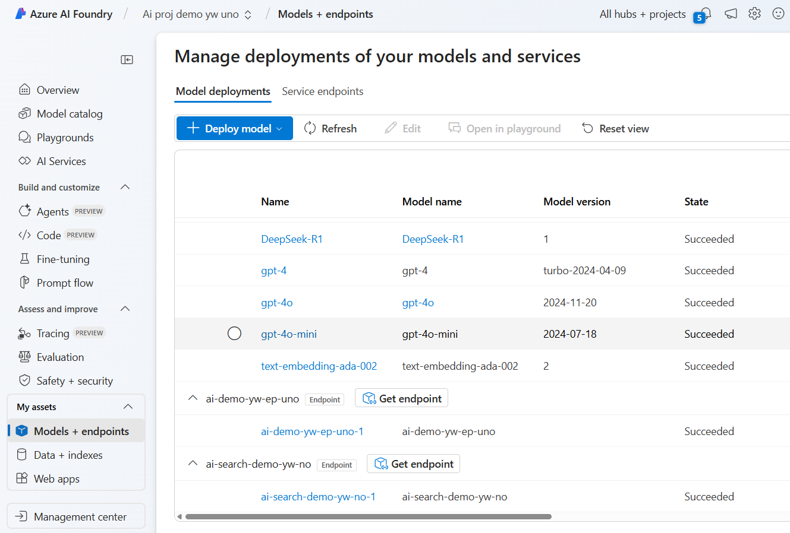
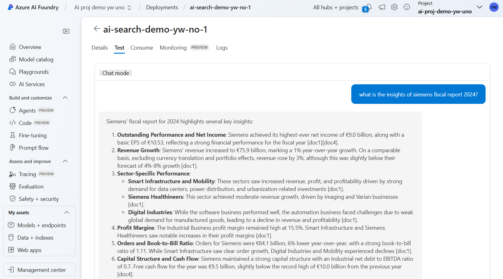
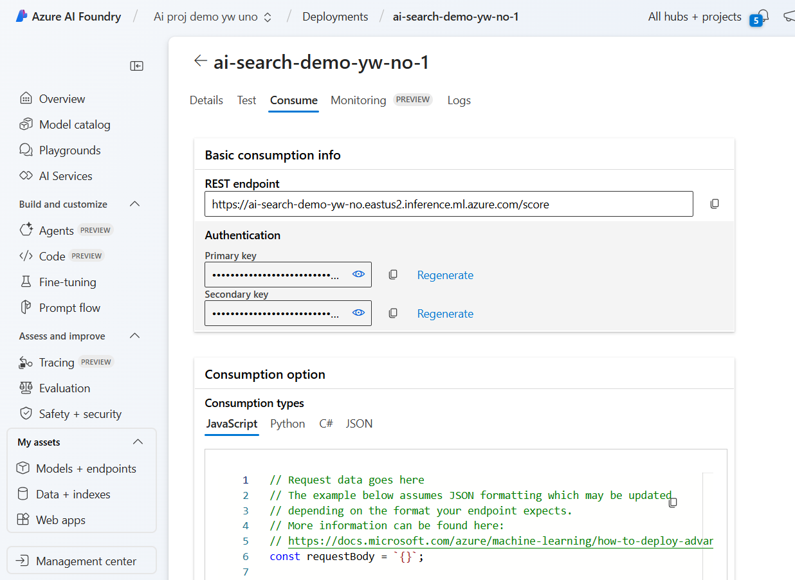

# Single Agent Workflow

This tutorial shows how to build a single agent workflow with Promptflow in Azure AI Foundry End-to-End. 

You can rapid prototype prompts for idealization using `Chat Playground`, test single agent in the Promptflow UI through a `Compute session`, and finally deploy your agent to an endpoint for serving the further downstream AI application such as Copilot created from Copilot Studio.


## Create single agent workflow from Chat playground

1. Open `Chat playground` by navigate to `Models + endpoints` menu
* select the previously deployed model `gpt-4o`

2. In Model Playground of `gpt-4o`:
* Click on `PromptFlow` 
to generate a promptflow template.

* Enter name: `report search`

2. In the PromptFlow View:
* Click on `Start Compute Session`


3. IMPORTANT: Update the libraries
* Open requirements.txt, edit with the following:
```txt
langdetect==1.0.9
promptflow-vectordb[azure]==0.2.16
promptflow==1.17.2
azureml-rag==0.2.38
```
* Save and install

* Reset `Compute session`


3. Test Singe Agent workflow by click on `chat` to start chat test:



4. Test the AI Search on previous unstructured pdf data, by start query:
```
what is the insights of siemens fiscal report 2024?
```




4. Deploy Single Agent workflow with `Deploy`:
* Click on `Deploy`
* Endpoint: New
* Endpoint name: `ai-search-demo-<your name>-uno`
* Virtual machine: `Standard_D2as_v4`

* Next


5. In the `Advanced settings - Endpoint` plane
* Authentication type: key-based
* Identity type: System-assigned
* Review + Create
* Create

The deployment will take upto 15min time.

6. After the successful deployment, you can find the endpoint and agent in `Models + endpoints`



7. Test the deployment using the `test` plane in agent deployment
```
what is the insights of siemens fiscal report 2024?
```
Note: if you don't get the desired response, try again. 



8. Visit the `consume` plane of your deployed agent workflow to see how to consume the REST API endpoint


9. Test the REST API endpoint with
* Test using Linux Bash:
```sh
curl -X POST "https://ai-search-demo-<your name>-uno.eastus2.inference.ml.azure.com/score" \
-H "Content-Type: application/json" \
-H "Authorization: Bearer <your_api_key>" \
-H "azureml-model-deployment: ai-search-demo-<your name>-uno-1" \
-d '{"query": "what is the insights of siemens fiscal report 2024?"}'
```

* Test inside Powershell

```powershell
# Define the API endpoint URL
$url = "https://ai-search-demo-<your name>-uno.eastus2.inference.ml.azure.com/score"

# Define the request headers
$headers = @{
    "Content-Type" = "application/json"
    "Authorization" = "Bearer <your_api_key>"  # Replace <your_api_key> with your actual API key
    "azureml-model-deployment" = "ai-search-demo-<your name>-uno-1"
}

# Define the request body, the query param is defined as arg for the promptflow inputs
$body = @{
    query = "what is the insights of siemens fiscal report 2024?"
}

# Make the POST request
try {
    $response = Invoke-RestMethod -Uri $url -Method Post -Headers $headers -Body ($body | ConvertTo-Json -Depth 10)
    Write-Output "Response:"
    Write-Output $response
} catch {
    Write-Error "Request failed: $_"
}
```

## Reference:
* reate a generative AI app that uses your own data https://microsoftlearning.github.io/mslearn-ai-studio/Instructions/04-Use-own-data.html