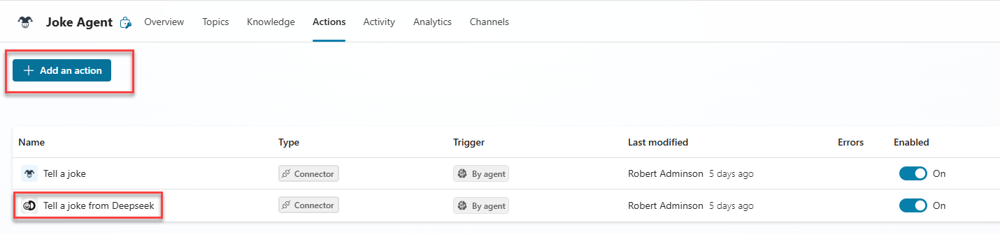

# Copilot Studio Connecting to Azure Foundry

## Create your agent in copilot studio

Call the browser in InPrivate mode and follow the link [[Copilot Studio]](https://copilotstudio.preview.microsoft.com).

Use the user credentials assigned to you to sign into the CDX demo tenant. Set-Up the MFA as described in the previous document..
When you set up the MFA you can create a new user profile in browser so that you can log in again without having to enter the credentials.

In Copilot Studio, you can create a new agent by entering a description. Assure that you have selected your own personal developer environment in the upper right corner.

 

 You can continue in the creation dialogue and enter decriptions or use "Skip to configure" button to use the configuration pane directly in agent.
 Upon finishing, press "Create" to create your agent.

After your agent is created, enable GenAI orchestration and disable the feature "Allow the AI to use its own general knowledge."

## Add an action to your agent

### 1. Create a custom connector 
For your agent to connect to Azure Foundry or any other endpoints, you need to create a custom connector.

Go to [[Power Automate]](https://make.preview.powerautomate.com)
You will have to switch on some menu points on the left side

Choose "Discover all" and turn on the "Connections", "Connectors" and  "Custom Connectors"

Go to the menu point "custom connectors" and create a new one from blank. Enter a name "AI Joke Connector" or whatever you like.

After you did this, hit "Create connector"

Switch the button "Swagger editor" on and copy the swagger file into the editor.

Here is the swagger file as template for an endpoint already created some time ago via Prompt Flow:

[Endpoint swagger template](main/imgs_mcs/custom_connector_AF_endpoint_swagger_file.yaml)

In the template you can adjust the model name and the host to your endpoint data or create a new swagger file.

Move to the tab 6.Test and create a new connection

If you are testing the endpoint enter API Key in format `Bearer <your api key>` and hit "Create connection". You need to physically type word "Bearer" followed by your api key.

If you are testing direct LLM endpoint than you won't need the word Bearer and can just copy the key. 

Refresh the Connections and choose the one you just created. Enter the parameters that are relevant for this enpoint or model. F.e.:
- model deployment name
- topic
- role
- content 
- ...

and hit "Test operation"

If everything works fine, you will see the answer in the Body window.

Or another example of test:

### 2. Add an action to your agent

Now as the custom connector is working, you can add and use it in your agent, which was previously created in Copilot Studio. Open the agent in Copilot Studio and hit the button "Add action"

Enter the name of your custom connector or pick up the category "Custom connector"

#### 2a. Add custom connector for your deplyed endpoint

The system will ask for the connection, just confirm it as it was created in previous step and hit "Next". Ignore the warnings and hit "Add action".

With this step the action was added to the agent. Now we have to configure it properly for orchestrator to use it in the right way.

Note: the screen will look different before and after the action creation. "Input" and "Output" tabs will be there after you add the action. During creation you will find them underneat the "Details".

Go to the "Actions" tab and klick on your action. You will see 3 subtabs where you can enter "Details", "Inputs" and "Outputs"

On the "Details" tab enter "Action name", "Display name" and "Description" in a way that it is easy recognizable when to use it.
 

Leave the remaining parameters as default.

On the tab "Inputs" change the type of the first parameter into "Set as a value" and enter the name of you model into "Value" field. 

In the "Topic" parameter adjust the display name and description acordingly.

In the output tab enter the description of the response parameter and choose the option "Send a message immediately after running this action" with "AI dynamically generated a message (default)"

Hit save and you are ready to test the agent in a test pane.

If this is a first time, connect again to your connection and hit "Retry" in the test pane.

Congratulations! You have created your first agent in Copilot Studio, connected to Azure AI Foundry.

### 3. Publish your agent to teams and M365 Copilot

After you created and tested your agent successfully, you can publish it in Teams Channel. 

Go to the Channel tab, select the "Teams + Microsoft 365" decide if you want to publish in M365 Copilot Chat and hit "Add Channel".

After that you will be asked to publish the agent. Hit the button "Publish".

You can edit some details if you want, like change the icon and color and decide if agent can be added to team or channel.

To access your agent in teams, you klick on "See agent in Teams" or "Get a link" in Availability Options. With link you will be guided to a Teams app where you can add the agent and open it via Teams or M365 Copilot.

Note: Due to the CDX bug this currently only works in a Teams Desktop app, therefore you will need to sign in into your desktop teams with your demo credentials. Once you added the agent in the desktop app, you can see it in web app also.

Move back to the teams Web version and start the agent. You can now chat with the agent in your Teams app.

### 4. Adding another action to the same agent

In the same way you can add more actions to the agent. These actions can be already prebuilt connectors or you can make another custom connector. You can perfrom the same steps as in the previous connector, and adjust:
1. endpoint URL
2. model name
3. connection reference

Swagger example (use the same file as in previous connector)

Go back to Copilot Studio and add a new action to your agent.

Adjust the description, inputs and outputs so that the orchestrator is able to call the action when the right user question is asked.

Inputs - your model name.

In the outputs, you can choose a different option in order to distinguish both LLMs and provide own message with the output variable.

