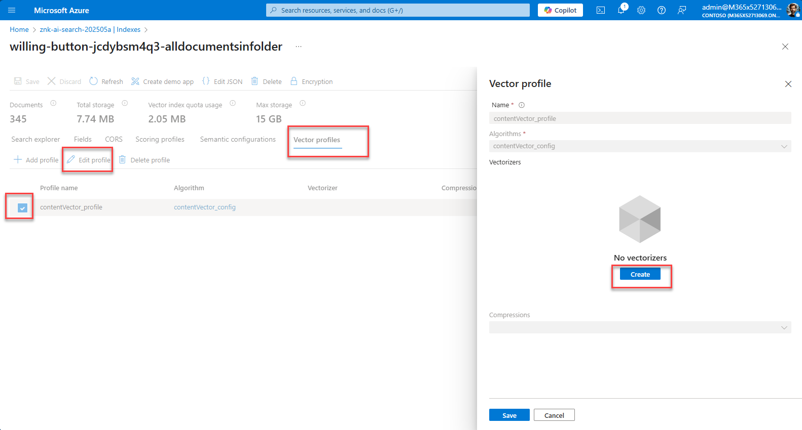
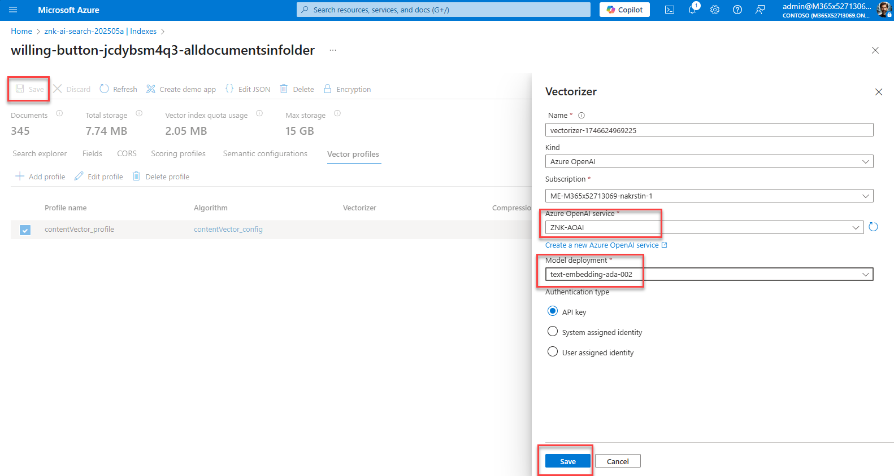
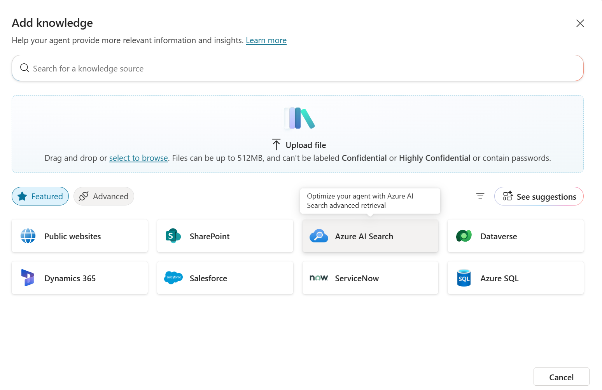
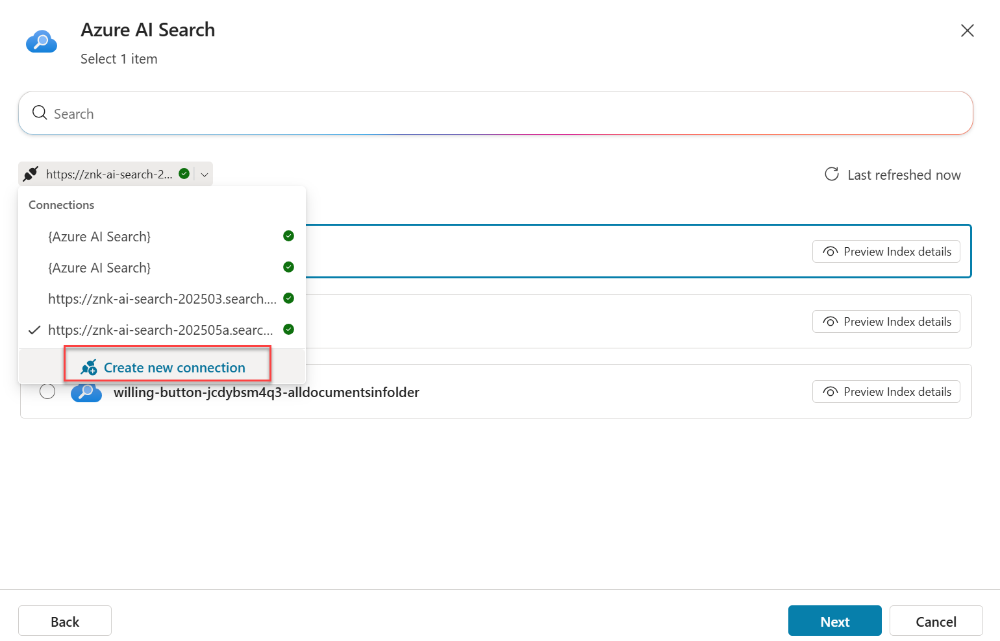
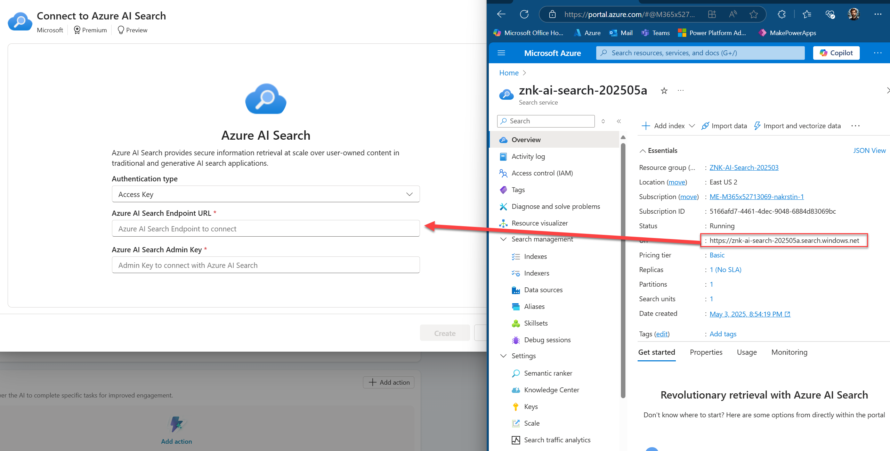
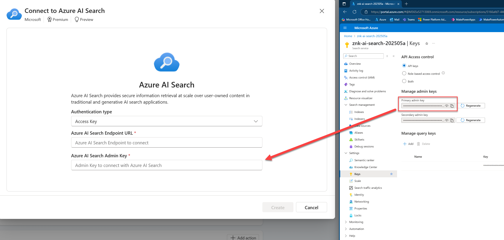
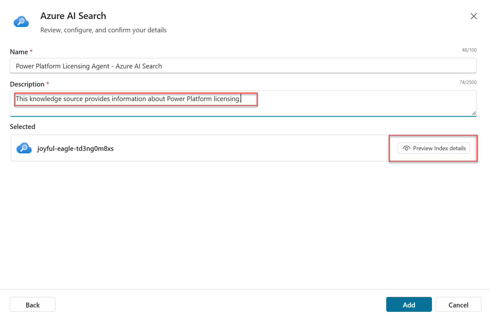
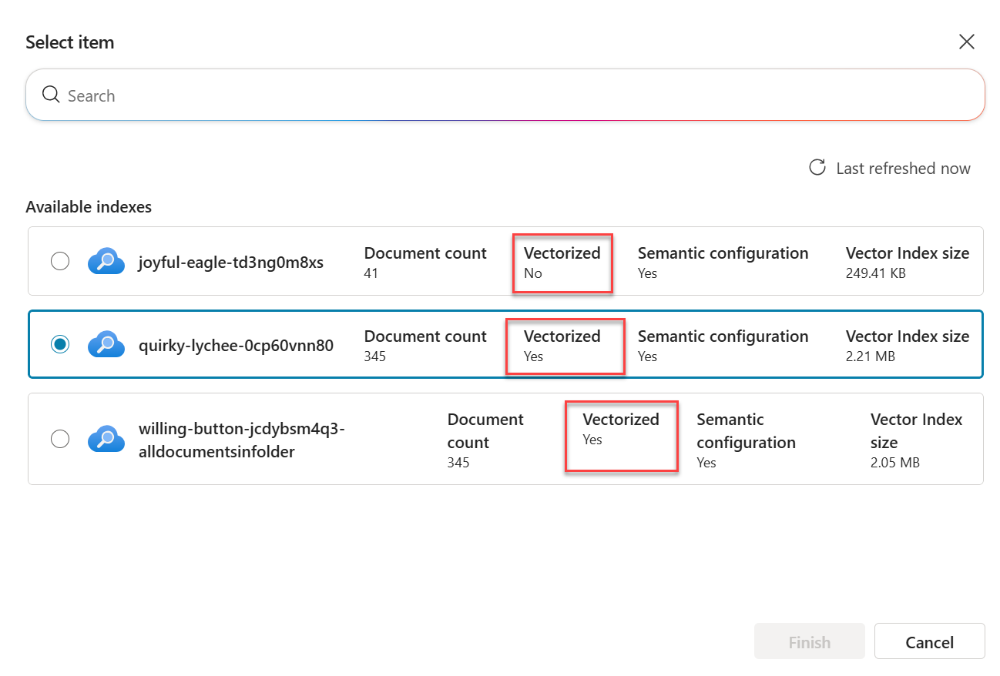
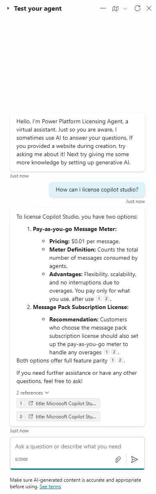

# Copilot Studio Connecting to Azure AI Search

This Agent will provide user with answers to the questions grounded in documents that are stored in the Blob storage and indexed via Azure AI Search. AI Search assets have been created in part 02.

AI Search in Copilot Studio will work only if the index is vectorized. Therefore check it first and vectorize if necessary. 

Create your agent in Copilot Studio as already done in previous exercise.

Enter the description and activate GenAI orchestration. Remove the flag `Allow the AI to use its own general knowledge`.

Add knowledge source to your agent and choose the AI Search.

Choose `Create new connection` and enter the credentials to your AI Search ressource.

Enter your AI Search credentials: 

Enter a description for the knowledge source and check the indices.

If the inidex is vectorized, than it will work fine. If not - datasource will not be found. Choose the vectorized one.

Save and finish. Now your agent is ready to be tested. Nothing more must be done as it looks for relevant answers in the AI Search.

Publish your agent to Teams or M365 Copilot if wanted.

