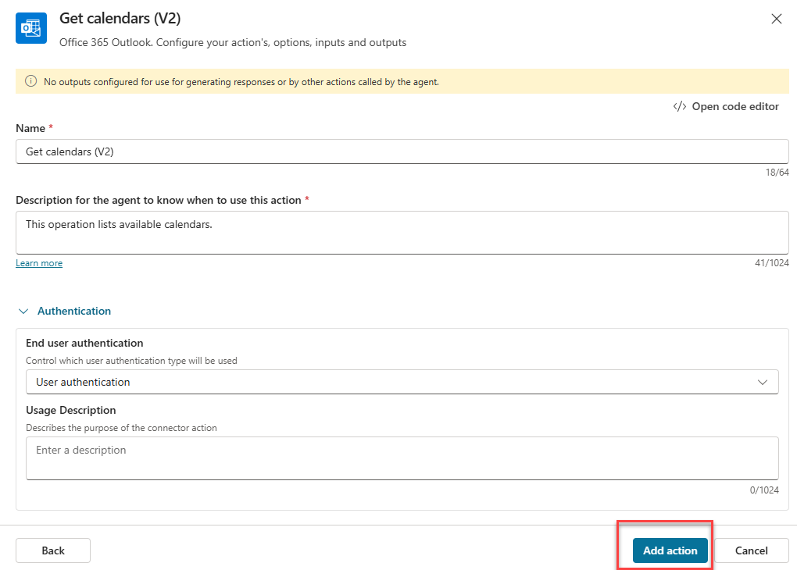

# Copilot Studio with Office365 and Azure Foundry

## Option 1 - agent connecting to Outlook Calendar
This Agent will connect to user calendar or mailbox and call previously created connector with the information from the calendar event. You can also create a new agent.

You can use your previously created Joke telling agent.

Just go to the agent and add another action.

Add a `Get calendars (V2)` action. This action will get the calendar ID of the user.

Confirm the connection or create a new one to Outlook and klick `Next`.

Enter descriptions and confirm with `Add action`. You don't need to fill out any other parameters.

Reapeat the same procedure for the action `Get calendar view of events (V3)`

Now your actions will look something like this:

That is all the configuration you have to do.

Create an event in your calendar with title `Elephants`

Go to the agent test pane and type the following prompt: `Tell me a joke from Deepseek about the event from my calendar today and use the title as topic for the joke.` 

The orchestrator will call all 3 actions in the right order to get the calendar, than the events title and finally call the endpoint.

